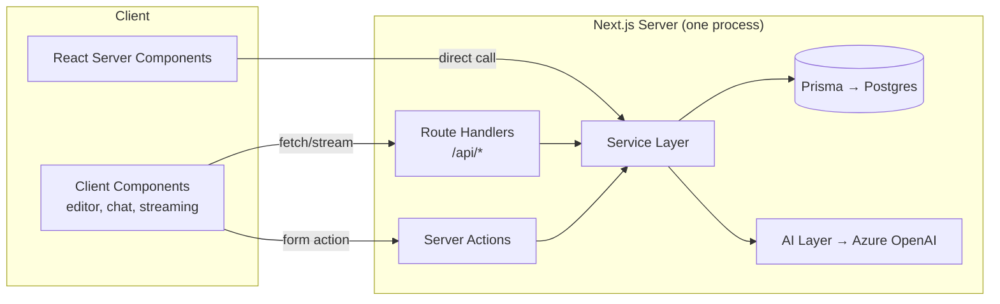
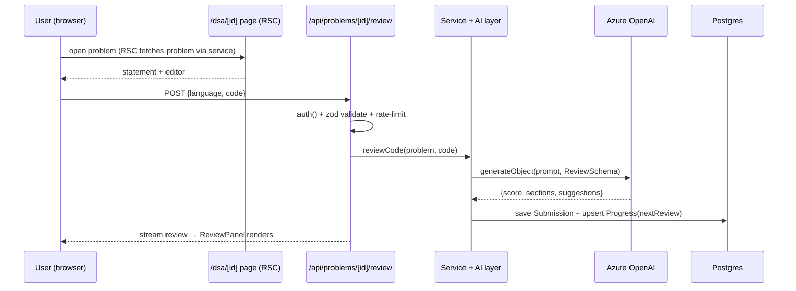
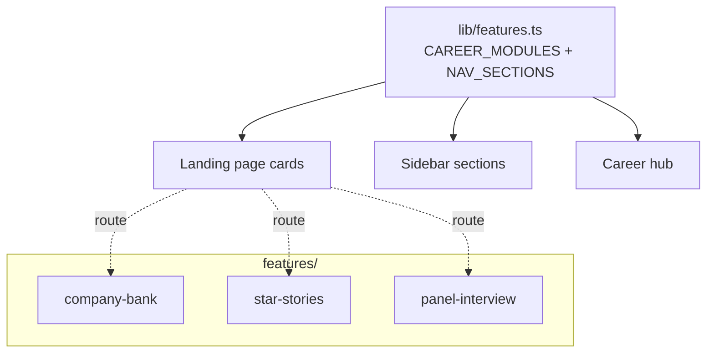
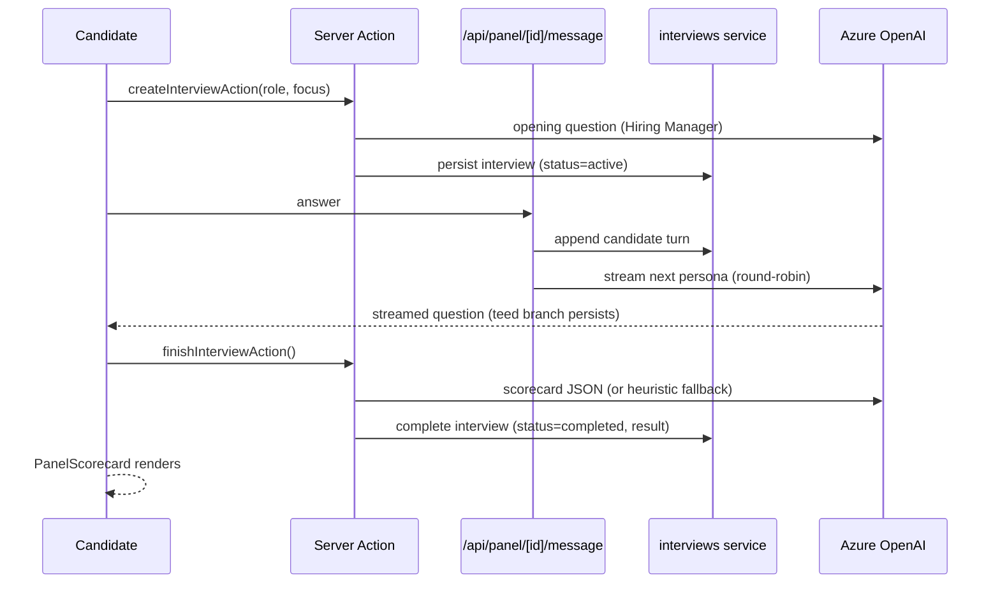

# ElevateIQ — End-to-End Design

**Phase 0** covered the interview-practice core (this document). **Phase 2** layers on a
feature-modular career platform; see [§10](#10-phase-2-feature-modules) below.

Full-stack **Next.js (App Router) + TypeScript**. One deployable serves both UI and API.
This document is the blueprint for the backend and UI.

---

## 1. High-Level Shape



**Rules of thumb**
- **Reads** (lists, detail pages, dashboard) → React Server Components call the **service layer directly** (no HTTP hop).
- **AI + streaming** (code review, mock chat) → **Route Handlers** returning a stream.
- **Simple mutations** (save progress, bookmark) → **Server Actions**.

---

## 2. Folder Structure

```
interviewprep/
├─ app/
│  ├─ (marketing)/page.tsx          # public landing
│  ├─ (app)/
│  │  ├─ layout.tsx                 # authed shell: sidebar + topbar
│  │  ├─ dashboard/page.tsx
│  │  ├─ dsa/page.tsx  dsa/[id]/page.tsx
│  │  ├─ system-design/page.tsx  system-design/[id]/page.tsx
│  │  ├─ lld/page.tsx  lld/[id]/page.tsx
│  │  ├─ behavioral/page.tsx  behavioral/[id]/page.tsx
│  │  └─ mock/page.tsx  mock/[id]/page.tsx
│  ├─ api/
│  │  ├─ auth/[...nextauth]/route.ts
│  │  ├─ problems/[id]/review/route.ts   # DSA AI review (stream)
│  │  ├─ design/[id]/review/route.ts     # HLD/LLD review
│  │  ├─ behavioral/[id]/review/route.ts # STAR review
│  │  └─ mock/[id]/message/route.ts      # mock interview turn (stream)
│  └─ layout.tsx  globals.css
├─ components/
│  ├─ ui/            # shadcn/ui primitives
│  ├─ layout/        # Sidebar, TopBar, ThemeToggle
│  ├─ problem/       # ProblemTable, FilterBar, DifficultyBadge, StatusPill
│  ├─ editor/        # CodeEditor (Monaco), LanguageSelect
│  ├─ review/        # ReviewPanel, ScoreRing, FeedbackAccordion
│  └─ mock/          # ChatInterview, ScoreCard
├─ lib/
│  ├─ db.ts          # Prisma client singleton
│  ├─ auth.ts        # Auth.js config + helpers
│  ├─ validation.ts  # zod helpers
│  └─ rate-limit.ts  # per-user daily AI cap
├─ services/
│  ├─ problems.ts    # getTracks, listProblems, getProblem
│  ├─ submissions.ts # createSubmission, listSubmissions
│  ├─ progress.ts    # getDashboard, upsertProgress (spaced repetition)
│  └─ ai/
│     ├─ client.ts   # Azure OpenAI client (via AI SDK)
│     ├─ prompts.ts  # prompt templates per track
│     ├─ schemas.ts  # zod schemas for structured AI output
│     ├─ review.ts   # reviewCode / reviewDesign / reviewBehavioral
│     └─ mock.ts     # mock interview turn logic
├─ prisma/
│  ├─ schema.prisma
│  └─ seed.ts
├─ content/          # seed problems (MDX/JSON)
├─ middleware.ts     # route protection
├─ next.config.mjs   # output: 'standalone'
├─ Dockerfile
└─ package.json
```

---

## 3. Data Model (Prisma)

```prisma
enum TrackKey { DSA SYSTEM_DESIGN LLD BEHAVIORAL }
enum Difficulty { EASY MEDIUM HARD }
enum SubmissionStatus { REVIEWED FAILED }
enum ProgressStatus { TODO ATTEMPTED SOLVED }

model User {
  id            String   @id @default(cuid())
  name          String?
  email         String?  @unique
  image         String?
  createdAt     DateTime @default(now())
  submissions   Submission[]
  progress      Progress[]
  mockInterviews MockInterview[]
  // + Auth.js relations: accounts, sessions
}

model Track {
  id       String    @id @default(cuid())
  key      TrackKey  @unique
  title    String
  problems Problem[]
}

model Problem {
  id                String     @id @default(cuid())
  track             Track      @relation(fields: [trackId], references: [id])
  trackId           String
  title             String
  slug              String     @unique
  difficulty        Difficulty
  tags              String[]
  statementMD       String
  constraints       String?
  hints             String[]
  referenceSolution String?
  createdAt         DateTime   @default(now())
  submissions       Submission[]
  progress          Progress[]
}

model Submission {
  id         String   @id @default(cuid())
  user       User     @relation(fields: [userId], references: [id])
  userId     String
  problem    Problem  @relation(fields: [problemId], references: [id])
  problemId  String
  language   String?          // DSA/LLD
  content    String           // code or design/answer text
  aiFeedback Json             // structured review
  score      Int?
  status     SubmissionStatus @default(REVIEWED)
  createdAt  DateTime @default(now())
}

model Progress {
  user        User           @relation(fields: [userId], references: [id])
  userId      String
  problem     Problem        @relation(fields: [problemId], references: [id])
  problemId   String
  status      ProgressStatus @default(TODO)
  lastScore   Int?
  lastAttempt DateTime?
  nextReview  DateTime?       // spaced repetition
  @@id([userId, problemId])
}

model MockInterview {
  id         String   @id @default(cuid())
  user       User     @relation(fields: [userId], references: [id])
  userId     String
  trackKey   TrackKey
  transcript Json     // [{role, content}]
  summary    Json?    // scorecard
  createdAt  DateTime @default(now())
}
```

---

## 4. API Surface

| Method | Path | Type | Purpose |
|--------|------|------|---------|
| `*` | `/api/auth/[...nextauth]` | Auth.js | Sign in / out, session |
| `GET` | *(RSC service)* `listProblems` | Server | List problems w/ filters (track, difficulty, tag, status) |
| `GET` | *(RSC service)* `getProblem` | Server | Problem detail |
| `POST` | `/api/problems/[id]/review` | Stream | DSA: `{language, code}` → streamed AI review, saves Submission + Progress |
| `POST` | `/api/design/[id]/review` | Stream | HLD/LLD: `{designText}` → rubric feedback |
| `POST` | `/api/behavioral/[id]/review` | Stream | Behavioral: `{answer}` → STAR feedback |
| `POST` | `/api/mock/[id]/message` | Stream | Mock interview next turn |
| Action | `startMock(trackKey)` | Server Action | Create MockInterview, seed first question |
| Action | `finishMock(id)` | Server Action | Generate scorecard summary |
| Action | `upsertProgress(...)` | Server Action | Update status / bookmark |

**Request validation**: every handler validates its body with a **zod** schema; invalid → `400 {error, code}`.
**Auth**: handlers call `auth()`; unauthenticated → `401`.
**Rate limit**: per-user daily AI-call cap checked before hitting Azure OpenAI.

---

## 5. AI Layer

- **Client**: Vercel AI SDK with `@ai-sdk/azure` pointing at your Azure OpenAI deployment.
- **Structured reviews**: `generateObject` + zod schema → deterministic JSON we can render and store.
- **Mock interview**: `streamText` for multi-turn chat with an interviewer system prompt.

**Review output schema (shared)**
```ts
const ReviewSchema = z.object({
  score: z.number().min(0).max(100),
  summary: z.string(),
  sections: z.array(z.object({
    title: z.string(),          // e.g. "Correctness", "Complexity", "Edge cases"
    rating: z.enum(["good","ok","poor"]),
    detail: z.string(),
  })),
  suggestions: z.array(z.string()),
});
```

**Prompt families**
- `codeReview(problem, code, language)` → correctness reasoning, time/space complexity, edge cases, improvements. *(Caveat: no execution — AI judgment, not a judge.)*
- `designReview(problem, designText)` → requirements coverage, components, data model, scaling, tradeoffs.
- `behavioralReview(question, answer)` → STAR completeness + impact + clarity.
- `mockTurn(history, trackKey)` → interviewer persona, one adaptive follow-up at a time.

**Cost controls**: default `gpt-4o-mini`, cap `maxTokens`, per-user daily cap, stream so users see progress.

---

## 6. Auth Flow

```mermaid
sequenceDiagram
    participant U as User
    participant App as Next.js
    participant P as GitHub/Google
    U->>App: Click "Sign in"
    App->>P: OAuth redirect
    P-->>App: code → Auth.js exchanges for profile
    App->>App: Prisma adapter upserts User + Account + Session
    App-->>U: Session cookie; middleware allows /app/*
```

- **Auth.js v5**, providers: GitHub + Google, **Prisma adapter**, DB sessions.
- `middleware.ts` protects `(app)` routes; `auth()` helper in server components/handlers.

---

## 7. UI Design

### Navigation shell (authed)
```
┌───────────────────────────────────────────────────────────┐
│ Logo   [ search ]                              🌙  [avatar] │  top bar
├──────────┬────────────────────────────────────────────────┤
│ Dashboard│                                                 │
│ DSA      │              page content                       │
│ Sys Deng │                                                 │
│ LLD      │                                                 │
│ Behavior │                                                 │
│ Mock     │                                                 │
└──────────┴────────────────────────────────────────────────┘
```

### Route map
| Route | Page | Key components |
|-------|------|----------------|
| `/` | Landing | Hero, FeatureCards, SignInCTA |
| `/dashboard` | Overview | StreakWidget, ReviewQueue, ContinueList, ProgressByTrack |
| `/dsa` | Problem list | FilterBar, ProblemTable, DifficultyBadge, StatusPill |
| `/dsa/[id]` | Solve DSA | ProblemStatement + CodeEditor + ReviewPanel |
| `/system-design/[id]` | Solve HLD | Requirements + DesignTextarea + ReviewPanel |
| `/lld/[id]` | Solve LLD | Prompt + Editor + ReviewPanel |
| `/behavioral/[id]` | Answer | Question + AnswerBox + STAR ReviewPanel |
| `/mock`, `/mock/[id]` | Mock interview | TrackPicker → ChatInterview → ScoreCard |

### DSA solve page (wireframe)
```
┌──────────────── /dsa/two-sum ────────────────────────────┐
│ Two Sum        [Easy]  #arrays #hashmap        ● Solved   │
├────────────────────────┬─────────────────────────────────┤
│ Problem statement (MDX)│ Language ▾   [ Monaco editor ]   │
│ constraints            │                                  │
│ ▸ Hint 1  ▸ Hint 2     │            [ Get AI Review ]     │
│                        ├─────────────────────────────────┤
│                        │ ReviewPanel (streamed)          │
│                        │  ◐ Score 82   Summary…          │
│                        │  ✓ Correctness  ✓ Complexity    │
│                        │  ⚠ Edge cases   • Suggestions   │
└────────────────────────┴─────────────────────────────────┘
```

### Design system
- **Tailwind CSS + shadcn/ui**, dark mode, `lucide-react` icons.
- **Monaco** editor for code; `react-markdown`/MDX for statements.
- **State**: mostly Server Components; client only for editor, chat, and streaming via AI SDK hooks (`useObject`, `useChat`). No heavy global store.

---

## 8. End-to-End Data Flow — DSA Review



---

## 9. Phase 0 Definition of Done
1. Next.js + TS + Tailwind + shadcn app runs locally.
2. Prisma schema migrated to Postgres; seed loads ~5 problems/track.
3. Auth.js sign-in (GitHub/Google) works; routes protected.
4. **Vertical slice**: open a DSA problem → paste code → Azure OpenAI review streams in → Submission saved → Progress updates.
5. Dockerfile builds a standalone image; documented deploy to Azure (see DEPLOYMENT.md).

---

## 10. Phase 2: Feature Modules

Phase 2 turns ElevateIQ from an interview-practice app into a **modular career platform**.
The Phase 0 layer-based code is untouched; new work lands as self-contained vertical slices
under `features/` so modules can be added without restructuring.

### 10.1 Module anatomy

```
features/<module>/
  types.ts        Domain types + shared constants (single source of truth)
  services/       Persistence (dual backend) + business logic — no React
  ai/             Prompt templates + Zod schemas + AI calls (isolated, testable)
  components/     Presentational + client components (loading/empty/error states)
  utils.ts        Pure helpers — the unit-test target
  actions.ts      "use server" entry points the UI calls
  __tests__/      Vitest specs (utils / prompts / personas)
  index.ts        Public module API (barrel)
```

Boundaries: UI never imports another module's `services/` directly; modules communicate
through their public barrel. Business logic stays out of components; components only render
state and call `actions.ts`.

### 10.2 Registry-driven navigation

`lib/features.ts` is the single source of truth for career modules and grouped nav. Each
`FeatureModule` has a `status` of `live` or `soon`; the landing page, sidebar, and career hub
are generated from it. Shipping a module = flipping one entry — no wiring changes.



### 10.3 Dual-backend persistence

Every service checks `isDbConfigured`. With `DATABASE_URL` set it uses Prisma/Postgres;
otherwise it uses `createMemoryStore<T>()` from `features/shared/`. `getUserId()` returns the
signed-in id, a `LOCAL_GUEST_ID` in DB-less mode, or `null` (anonymous in DB mode → the page
renders a `SignInPrompt`). Services return DTOs with ISO-string dates for safe RSC
serialization.

### 10.4 Graceful AI degradation

AI-dependent modules stay fully usable without Azure OpenAI:

- **STAR generator** surfaces a clear "not configured" notice.
- **Panel interview** falls back to each persona's seed question bank for questioning and a
  deterministic `heuristicScorecard()` (flagged `aiGenerated: false`) for scoring, so the
  end-to-end flow still works in local/demo mode.

### 10.5 Modules delivered

| Module | Exercises | Persistence | AI |
| ------ | --------- | ----------- | -- |
| **Company Question Bank** | read-heavy reference + filter/search/bookmark/progress | bookmarks + progress rows | none (content JSON) |
| **AI STAR Story Generator** | AI generation + full user CRUD | StarStory rows | JSON generation (Zod-validated) |
| **Mock Panel Interview** | 3 personas + streaming + scoring + persistence | PanelInterview rows | streaming turns + JSON scorecard |

**Coming soon** (registry entries only): Interview History, Calendar Study Planner,
Resume Builder — each will follow the same slice anatomy.

### 10.6 Panel interview flow



