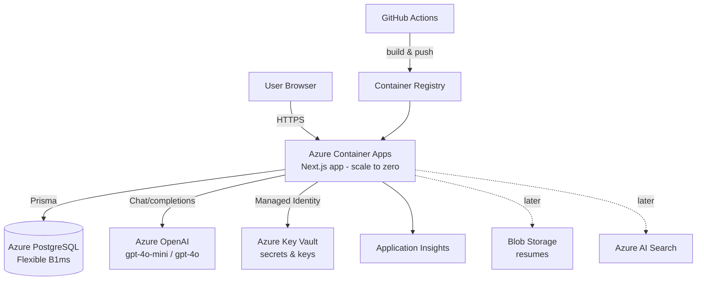

# InterviewPrep Platform — Build Plan

A single place to prepare for software interviews: **DSA**, **System Design (HLD)**, **LLD**,
and **Behavioral** rounds — powered by AI, hosted on **Azure**, built lightweight for low traffic.

---

## 1. Product Scope

### Phase 1 — MVP (Interview Prep Hub)
| Module | What it does |
|--------|--------------|
| **DSA practice** | Curated problems by topic/difficulty. User pastes a solution → AI reviews correctness, complexity, edge cases, and suggests improvements. Hints + reference solutions. *(No live code execution in MVP.)* |
| **System Design (HLD)** | Case-study prompts (e.g. "Design a URL shortener"). User submits a design → AI feedback on components, scalability, tradeoffs, bottlenecks against a rubric. |
| **LLD / OOD** | Object-oriented design problems + design-pattern questions. AI review of class design, SOLID adherence. |
| **Behavioral** | STAR-method question bank. User writes an answer → AI scores it on the STAR rubric and gives feedback. |
| **AI Mock Interview** | Multi-turn conversational interviewer per track, with adaptive follow-ups and a final summary. |
| **Progress tracking** | Solved/attempted status, scores, spaced-repetition "review next" queue, dashboard. |

### Later Phases (extensions)
- **Resume**: ATS-friendly resume builder + AI ATS-score/keyword feedback.
- **Interview Experience DB**: users share past interview experiences → AI generates a **personalized prep plan** for a target company/role.
- **Job Search**: aggregate/apply to jobs, track applications.
- **Community**: mentor reviews, referral requests.

---

## 2. Tech Stack

- **App**: Next.js (App Router) + TypeScript — single full-stack deployable (UI + API routes / server actions).
- **UI**: Tailwind CSS + shadcn/ui; MDX for rich problem statements; Monaco editor for code input.
- **AI**: Azure OpenAI (`gpt-4o-mini` default for cost, `gpt-4o` for heavy tasks) via the Vercel AI SDK (streaming).
- **DB**: Azure Database for PostgreSQL (Flexible Server, Burstable B1ms) + Prisma ORM.
- **Auth**: Auth.js (NextAuth) with **GitHub + Google** OAuth (GitHub login fits the dev audience). Sessions in Postgres.
- **Storage** (later): Azure Blob Storage for resumes.
- **Search** (later): Azure AI Search for interview experiences / jobs.
- **Secrets**: Azure Key Vault (via Managed Identity).
- **Observability**: Application Insights + Log Analytics.
- **IaC + deploy**: Bicep + Azure Developer CLI (`azd up`).
- **CI/CD**: GitHub Actions → build Docker image → Azure Container Registry → deploy.

---

## 3. Azure Architecture

**Hosting choice:** **Azure Container Apps** (scale-to-zero → ~$0 when idle, ideal for low traffic).
Simpler alternative: **App Service (Linux, B1)** if you prefer no containers.
Ultra-cheap alternative: Static Web Apps + Cosmos DB serverless (free tiers) — but limits Next.js SSR.

---

## 4. Data Model (MVP)

- **User**(id, name, email, image, provider, createdAt)
- **Track**(id, key: DSA|SYSTEM_DESIGN|LLD|BEHAVIORAL, title)
- **Problem**(id, trackId, title, difficulty, tags[], statementMD, constraints, hints[], referenceSolutionMD)
- **Submission**(id, userId, problemId, language, content, aiFeedback(json), score, status, createdAt)
- **MockInterview**(id, userId, trackId, transcript(json), summary, createdAt)
- **Progress**(userId, problemId, status, lastAttemptAt, nextReviewAt) — spaced repetition
- *(Later)* Resume, JobPosting, InterviewExperience, PrepPlan, Referral, Review

---

## 5. AI Feature Design

- **Code review** (DSA): prompt = problem + constraints + user code → structured JSON (correctness reasoning, time/space complexity, edge cases missed, improvements, score 0–100). *Caveat: no execution, so it's AI judgment, not a ground-truth judge.*
- **Design feedback** (HLD/LLD): rubric-scored (requirements, components, data model, scaling, tradeoffs).
- **Behavioral**: STAR rubric scoring (Situation/Task/Action/Result completeness, impact, clarity).
- **Mock interview**: system prompt = interviewer persona; adaptive follow-ups; ends with a scorecard.
- **Prep-plan generator** (later): target role + shared interview experiences + self-assessment → weekly plan.
- **Cost controls**: default to `gpt-4o-mini`, cap `max_tokens`, per-user rate limiting, cache reference content, stream responses.

---

## 6. Roadmap

| Phase | Focus | Deliverables |
|-------|-------|-------------|
| **0 — Foundations** | Scaffold + infra | Next.js+TS repo, Auth.js, Prisma+Postgres, Bicep/`azd`, ACR, CI/CD, App Insights |
| **1 — MVP** | Core modules + AI | 4 tracks, seeded question bank, AI review endpoints, progress tracking, basic mock interview |
| **2 — Polish** | UX + reliability | Dashboards, spaced repetition, filters/search, streaming UI, rate limiting |
| **3 — Resume** | ATS builder | Resume editor, AI ATS scoring, Blob storage |
| **4 — Prep plans** | Personalization | Interview-experience DB, AI prep-plan generator |
| **5 — Jobs/Community** | Growth | Job aggregation, apply/track, referrals, mentor reviews |

---

## 7. Rough Monthly Cost (low traffic)

| Service | Est. |
|---------|------|
| Container Apps (scale to zero) | $0–15 |
| PostgreSQL Flexible B1ms | $12–15 (or stop when idle) |
| Azure OpenAI (gpt-4o-mini) | $5–20 (pay per token) |
| Key Vault + App Insights + ACR | ~$5 |
| **Total** | **~$25–60/mo** |

---

## 8. Immediate Next Steps

1. Scaffold Next.js + TypeScript + Tailwind + Prisma.
2. Add Auth.js (GitHub/Google) and the Prisma schema above.
3. Wire one end-to-end vertical slice: **DSA problem → paste solution → Azure OpenAI review → save submission**.
4. Seed ~5 problems per track.
5. Add `azd`/Bicep infra and deploy to Azure Container Apps.
