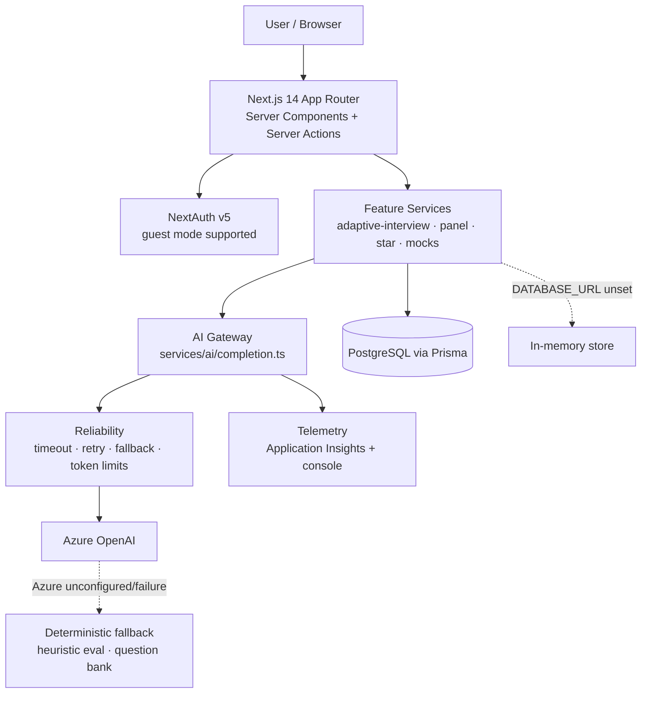
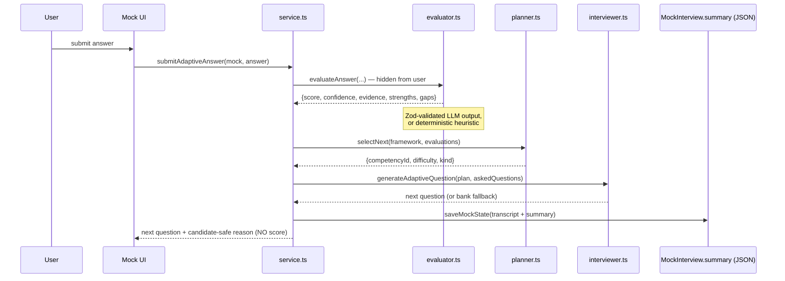

# Compile Ready — Technical Design Document

> A production engineering design document grounded in the current codebase.
> Ideas that are not yet built are labelled **Future improvement**.

---

## 1. Overview

Compile Ready is a web platform that helps software engineers prepare for technical interviews. It combines a large library of **hand-written learning content** (DSA, System Design, Low-Level Design, programming languages, cloud/DevOps, Generative AI) with several **AI-assisted features**.

**Problem it solves:** static prep (reading solutions, browsing question lists) is passive. It doesn't tell a user how good their own answer was, and it doesn't adapt to their weak areas. Compile Ready adds a feedback loop.

**Major product capabilities (present in the code):**
- **Adaptive Mock Interview** — the primary AI workflow (see §4).
- **Panel Interview** — three AI personas conduct an interview and produce a scorecard.
- **STAR Story Generator** — turns project details into a structured STAR story.
- **Code review / solve** — AI feedback and a score on a submitted solution.
- **Company Question Bank** — static company questions with bookmarks and progress.
- **Learning courses** — registry-driven static content across multiple tracks.
- **AI Labs** — interactive teaching demos of AI concepts.
- **Interview history** — lists a user's past interviews.

The **Adaptive Mock Interview** is the flagship: it asks a question, evaluates the answer, finds the weakest competency, and adaptively selects the next question — ending in a detailed scorecard.

---

## 2. Goals and Non-Goals

**Goals**
- Give users realistic, adaptive interview practice with meaningful feedback.
- Keep the system working even when the database or the AI provider is unavailable.
- Keep AI output structured, validated, and safe to build logic on.
- Make new learning content and new features cheap to add (feature-based modules + registries).

**Non-Goals (intentionally out of scope in the current code)**
- **RAG** / vector search — not implemented.
- **Multi-agent orchestration** — not implemented.
- **Resume builder, calendar study planner** — specified in a broader plan but not built.
- **Asynchronous/queue-based processing** — the flow is synchronous.
- **Fine-tuned models** — prompting only.

**Current limitations**
- AI-output quality is validated structurally (schema) and tested via a deterministic path; the **actual LLM output is not yet evaluated** against a labelled dataset (see §7).
- No queueing/caching; concurrency is bounded largely by Azure OpenAI limits.
- Prompt-injection hardening and per-user rate limiting are not implemented.

---

## 3. High-Level Architecture

**Component responsibilities**
- **Next.js application** — serves UI (server components) and handles mutations via Server Actions and a few streaming API routes. It is both the frontend and the backend; there is no separate backend service.
- **Authentication (NextAuth v5)** — email/password (bcrypt) plus optional OAuth providers. Guest mode is allowed; guests persist nothing.
- **Feature services** — the business logic for each feature (orchestration, persistence calls).
- **AI Gateway** — the single entry point for every LLM call (`runChatCompletion`). Central place for reliability and telemetry.
- **Reliability layer** — timeout, bounded retry with backoff, fallback model, token limits.
- **Azure OpenAI** — the LLM provider.
- **Telemetry** — records AI call metadata to Application Insights (and console).
- **PostgreSQL / Prisma** — persistence for user data; **optional**.
- **In-memory store** — used automatically when `DATABASE_URL` is unset, so the app still runs.
- **Deterministic fallback** — heuristic evaluation and a question bank used when Azure is unconfigured or a call fails.

---

## 4. Adaptive Mock Interview

The adaptive interview lives in `features/adaptive-interview/`, orchestrated by `service.ts`. The key design idea is a clear split:

- **Deterministic logic** decides *flow* — which competency to target, whether to probe / follow up / advance, difficulty, and all scoring math (`planner.ts`, `scorecard.ts`, `competencies.ts`).
- **The LLM** only handles *language* — writing the question wording and grading the free-text answer (`ai/interviewer.ts`, `ai/evaluator.ts`).

**End-to-end flow:** start → ask question → user answers → evaluate answer (hidden) → competency scores → find weakest competency → planner selects next action → generate question → present next question → persist state → repeat → final scorecard.

**Notes**
- Per-answer scores are computed server-side but **never returned during the interview**. They surface only in the final scorecard (`finalizeAdaptiveInterview` → `buildScorecard`).
- The planner uses thresholds to choose the next action (e.g. follow up on weak answers, advance on strong ones) and avoids repeating the same competency too many times in a row.
- `finalize` is idempotent — it returns the existing scorecard if already completed.

---

## 5. AI Architecture

**Why an LLM is used:** grading a nuanced free-text answer and writing a relevant follow-up are open-ended language tasks that rule-based logic cannot do well.

**Azure OpenAI integration** (`services/ai/client.ts`, config in `lib/env.ts`):
- Endpoint + key from `AZURE_OPENAI_ENDPOINT` / `AZURE_OPENAI_API_KEY`.
- **Model selection:** `AZURE_OPENAI_DEPLOYMENT`, default **`gpt-4o-mini`** — a small, fast, low-cost model that is sufficient for grading and question generation.
- API version default `2024-08-01-preview`.

**Prompt structure** (`features/adaptive-interview/ai/prompts.ts`): a `system` message carrying the role, the rubric/competencies, and a strict output contract; a `user` message carrying the concrete question and answer (or project details). Two prompts:
- **Evaluator** — returns JSON: `score` (0–100), `confidence` (0–1), `matchedConcepts`, `evidence`, `strengths`, `gaps`.
- **Interviewer** — returns JSON: `{ "question": "..." }`, told not to repeat already-asked questions or reveal scores.

**Structured JSON output + Zod validation:** both calls use `response_format: json_object` and are validated with Zod schemas (`ai/schemas.ts`). Unparseable output is rejected and the deterministic fallback is used.

**Prompt versioning:** all versions live in `services/ai/prompt-versions.ts` (e.g. `adaptive-evaluator@2026-02`, `adaptive-interviewer@2026-02`). The version is stored with each evaluation and emitted in telemetry, so results can be correlated to a specific prompt revision.

**Context sent to the model:** intentionally small and focused — the current question, the current answer, the target competency's rubric, and (for follow-ups) the last answer plus the list of already-asked questions. **Full interview history is not sent**, because it is unnecessary for grading a single answer and would increase tokens, cost, and latency without improving the result.

**Design principle:** *the LLM handles probabilistic language tasks, while deterministic application logic controls important system behavior* (flow, scoring, ownership). The LLM is not the source of truth.

---

## 6. AI Reliability and Failure Handling

Reliability is centralized in `services/ai/reliability.ts` and the two AI call sites.

| Concern | Mechanism |
|---|---|
| **Timeout** | `AI_REQUEST_TIMEOUT_MS` (default 30000 ms) via AbortController; aborts the socket. |
| **Retry** | `AI_MAX_RETRIES` (default 2), transient errors only (408/409/425/429, 5xx, network). |
| **Backoff** | Exponential backoff with full jitter (`AI_RETRY_BASE_MS`, default 500 ms). |
| **Fallback model** | `AZURE_OPENAI_FALLBACK_DEPLOYMENT` used when the primary model fails. |
| **Token limits** | `AI_MAX_INPUT_TOKENS` (12000) / `AI_MAX_OUTPUT_TOKENS` (2000). |
| **Invalid JSON** | Zod `safeParse`; on failure, use the deterministic path. |
| **Repeated questions** | A generated question matching a prior one is rejected and replaced from the bank. |
| **Missing AI config** | `AiNotConfiguredError` → heuristic evaluation / question bank. |

**Fallbacks that keep the system working when AI is unavailable:**
- **Heuristic evaluation** (`heuristicEvaluateAnswer`) — scores by concept coverage (~70%) plus answer depth (~30%); fully deterministic, no network.
- **Question-bank fallback** (`heuristicQuestion`) — picks an unused, laddered question for the target competency/difficulty.

Because both AI call sites degrade to these fallbacks, an interview can run start-to-finish with no Azure configuration at all.

---

## 7. AI Evaluation

**Current implementation**
- **Golden dataset** (`features/adaptive-interview/golden/dataset.ts`) — **40 representative cases** with expected concepts and expected score ranges.
- **Regression tests** (`features/adaptive-interview/__tests__/`) — assert the dataset size is within 30–50, that expected concepts are detected, and that strong answers score high while weak answers score low.
- **Deterministic evaluation path** — the tests run against `heuristicEvaluateAnswer`, so they are hermetic (no network) and reproducible.
- **Confidence** is captured on every evaluation and shown on the scorecard.

**Future improvement (not implemented)**
- Evaluating the **actual LLM output** (not just the heuristic) against a labelled/golden set (LLM-as-judge or human labels).
- **Online evaluation** using real user feedback (e.g. thumbs up/down) and score-drift tracking.
- **Prompt-change regression** — running the golden set through a new prompt version before it ships.

> The current suite validates the deterministic evaluator and the structure of AI output. It does **not** yet measure the quality of the live LLM grading.

---

## 8. Key Technical Decisions and Trade-offs

| Decision | Problem → Decision → Why | Trade-off |
|---|---|---|
| **LLM vs deterministic logic** | Need to judge/generate language, but keep behavior predictable → use LLM only for language, code for flow/scoring → reliability + testability | More code paths |
| **Rule-based planner vs LLM-driven** | Next-question choice must be predictable → planner in code → deterministic, unit-testable | Less emergent behavior |
| **Small model vs larger model** | Grading is a modest task → default `gpt-4o-mini` → low cost + latency | Lower reasoning ceiling |
| **Prompting vs fine-tuning** | Need fast iteration → prompt-based → no training pipeline | Less control over grading style |
| **Structured JSON vs free-form** | Must build logic on output → JSON + Zod → safe to parse | Occasional reformat/fallback |
| **AI fallback strategy** | AI can be down/unconfigured → heuristic + question bank → always functional | Fallback quality < LLM |
| **DB-backed vs in-memory** | Must run anywhere, support guest mode + hermetic tests → optional DB → flexible | Two persistence paths |
| **JSON summary vs normalized schema** | AI result shape evolves → store as JSON in `MockInterview.summary` → no migrations | Harder cross-interview querying |
| **Sync vs async** | Turns are naturally sequential → synchronous → simpler | Limited high-concurrency headroom |
| **No RAG vs RAG** | Grading is rubric-based; content is static → no RAG → simpler | No dynamic knowledge grounding |
| **Shared AI Gateway** | Reliability/telemetry needed everywhere → one gateway → consistent behavior | Minor indirection |

---

## 9. Scalability

**Current architecture**
- The Next.js application is **stateless** (interview state is persisted per request), so it scales **horizontally** behind Azure App Service.
- Practical concurrency is bounded primarily by **Azure OpenAI rate limits**, not the application code.
- Database is a standard single PostgreSQL instance (when configured).

**Current limitations**
- No queueing or background processing — a slow LLM call occupies the request.
- No caching layer.
- No per-user rate limiting.

**What would change at significantly higher scale (Future improvement)**
- **Async processing / queues** for evaluation so requests aren't blocked by the LLM.
- **Caching** for repeated static reads and (selectively) AI results.
- **Connection pooling / read replicas** for Postgres.
- **Rate limiting** at the edge, per user.
- **Failure isolation** — a global flag to serve heuristic mode if AI is degraded.

*(No current scale numbers are asserted — real traffic figures are **Needs confirmation**.)*

---

## 10. Latency and Cost

**Where latency comes from:** the request path is service → LLM → validation → persistence → response. The **LLM call dominates** end-to-end latency; database and validation are comparatively cheap.

**Main cost drivers:** number of LLM calls (roughly one evaluation + one question per turn), prompt size (tokens), and model choice.

**Controls in the code**
- Small default model (`gpt-4o-mini`).
- Output tokens capped (`AI_MAX_OUTPUT_TOKENS`).
- Small, focused prompts (no full history).
- Deterministic heuristic path costs **$0** (no tokens).

**Cost estimate:** helper functions in `services/ai-labs/usage.ts` support cost estimation; a per-interview figure of roughly **~$0.02 on `gpt-4o-mini`** is an **estimate** based on a couple of short calls per turn and the default model — actual cost depends on answer length, model, and turn count.

**Quality ↔ Cost ↔ Latency:** larger models improve grading but raise cost and latency. The current design favors cost and latency, with a fallback model as a safety valve.

---

## 11. Security

**Implemented**
- **Authentication:** NextAuth v5; email/password hashed with bcrypt (`passwordHash`), optional OAuth providers.
- **Authorization / ownership:** a user can only access their own interview (ownership checks reject `mock.userId !== userId`).
- **Input validation:** Zod on inputs (e.g. message length capped at 4000 chars).
- **Secret management:** all keys read from environment variables (`lib/env.ts`); nothing committed.
- **Guest mode:** persists nothing.
- **Telemetry data handling:** AI telemetry records only counts, labels, and ids — **never** answers, prompts, or secrets.

**Current gaps / Future improvement**
- **Prompt-injection protection** — user answers flow into prompts; mitigated by strict output contracts and validation, but not sanitized.
- **Per-user rate limiting** — not implemented.
- **Audit logging** — not implemented.

*(The above reflects only what is verifiable in the code; nothing is overstated.)*

---

## 12. Observability

- **Application Insights** integration in `services/ai/telemetry.ts` (enabled when `APPLICATIONINSIGHTS_CONNECTION_STRING` is set; loaded lazily via dynamic import).
- **AI telemetry** — `recordAiCall` emits an `AiCall` custom event plus `AiCallLatencyMs` and `AiEstimatedCostUsd` metrics, and always logs a PII-free line to the console.
- **Captured fields:** model, prompt version, latency, input/output tokens, success/failure, retry count, fallback usage, estimated cost, and a correlation id.
- **Health endpoint:** `GET /api/health` returns `{ status, db, ai, time }` without touching external services.

**Dashboards / alerts:** **Needs confirmation** — none are defined in the repository; they would be configured in Azure.

---

## 13. Failure Scenarios

| Failure | Detection | Recovery | User Impact |
|---|---|---|---|
| LLM unavailable / down | Error in gateway call | Fallback model → heuristic | Interview continues; slightly simpler questions/grading |
| LLM timeout | 30s AbortController | Retry with backoff → heuristic | Slight delay, then continues |
| Rate limit (429) | HTTP status | Bounded backoff retry → fallback | Small delay |
| Malformed JSON | Zod `safeParse` fails | Deterministic heuristic path | None visible |
| Repeated question generated | Dedupe check | Replace from question bank | None visible |
| Database unavailable | `isDbConfigured` false / DB error | In-memory store; guest mode | No persistence across restarts |
| Network failure | Transient error class | Retry with jitter → fallback | Small delay |
| Invalid/empty user input | Zod validation | Reject or low score; flow continues | Prompted to answer properly |
| Missing AI configuration | `AiNotConfiguredError` | Heuristic + question bank | Fully functional, no LLM |

Pattern throughout: **detect → degrade gracefully → keep the flow alive.**

---

## 14. Production Considerations

- **Reliability:** central timeout/retry/fallback plus deterministic fallbacks make the AI path fault-tolerant.
- **Scalability:** stateless app scales horizontally; LLM rate limits and lack of async are the main ceilings.
- **Security:** auth, ownership checks, input validation, and PII-free telemetry are in place; prompt-injection and rate limiting are gaps.
- **Observability:** structured AI telemetry to Application Insights + a health endpoint; dashboards/alerts **Needs confirmation**.
- **Cost:** controlled via small model, token caps, focused prompts, and a $0 fallback.
- **Maintainability:** feature-based modules, registries for content, one AI gateway, and a versioned prompt registry make the system easy to extend.
- **Deployment:** deployed to **Azure App Service** as a source zip; the platform build (Oryx) runs `npm ci && prisma generate && next build`. Exclude `node_modules`, `.next`, and `.env` from the zip.

---

## 15. Current Limitations and Future Improvements

**Current limitations**
- LLM output quality is not directly evaluated against a labelled dataset.
- No async processing, queues, or caching.
- No prompt-injection hardening, per-user rate limiting, or audit logging.
- No RAG; grading is rubric-based only.
- Analytics live inside a JSON summary column, which is not ideal for cross-interview queries.

**Potential improvements (relevant to the existing architecture)**
- Evaluate the live LLM grading (LLM-as-judge / human labels) and run it on prompt changes.
- Introduce an async evaluation queue and result caching.
- Add per-user rate limiting and cost caps.
- Add prompt-injection defenses for text that enters prompts.
- Configure Application Insights dashboards and alerts on failure/fallback/cost.
- Normalize interview analytics into queryable tables (or a warehouse).

---

## 16. Engineering Ownership

Areas established from the repository:
- **AI evaluation** — evaluator prompt, schema, heuristic fallback (`ai/evaluator.ts`, `ai/schemas.ts`).
- **Adaptive interview orchestration** — `service.ts`, `planner.ts`, `scorecard.ts`, `competencies.ts`.
- **Prompt design + versioning** — `ai/prompts.ts`, `services/ai/prompt-versions.ts`.
- **AI Gateway + reliability** — `services/ai/completion.ts`, `reliability.ts`, `client.ts`.
- **Persistence** — `services/mocks.ts` (dual-backend, JSON summary storage).
- **Testing** — golden dataset + planner/scorecard/evaluator/flow tests (`__tests__/`).
- **Observability** — `services/ai/telemetry.ts`.
- **UI integration** — mock interview components (`features/adaptive-interview/components/`).

Exact contributor split across these areas is **Needs confirmation** (not derivable from source alone).

---

## 17. Appendix

**Important services / modules**
- `services/ai/completion.ts` — AI gateway entry (`runChatCompletion`, streaming variant).
- `services/ai/reliability.ts` — timeout, retry, backoff, fallback, token limits.
- `services/ai/client.ts` — Azure OpenAI client, model tuning, `AiNotConfiguredError`.
- `services/ai/telemetry.ts` — `recordAiCall` (App Insights + console).
- `services/ai/prompt-versions.ts` — prompt version registry.
- `services/mocks.ts` — interview persistence (Prisma or in-memory).
- `features/adaptive-interview/` — `service.ts`, `planner.ts`, `scorecard.ts`, `competencies.ts`, `copy.ts`, `types.ts`, `ai/*`, `golden/dataset.ts`.

**Important configuration variables** (`lib/env.ts` and reliability layer)
- `DATABASE_URL` — enables PostgreSQL persistence (else in-memory).
- `AZURE_OPENAI_ENDPOINT`, `AZURE_OPENAI_API_KEY` — enable the LLM (else heuristic).
- `AZURE_OPENAI_DEPLOYMENT` (default `gpt-4o-mini`), `AZURE_OPENAI_API_VERSION` (default `2024-08-01-preview`), `AZURE_OPENAI_FALLBACK_DEPLOYMENT`.
- `AI_REQUEST_TIMEOUT_MS` (30000), `AI_MAX_RETRIES` (2), `AI_RETRY_BASE_MS` (500), `AI_MAX_INPUT_TOKENS` (12000), `AI_MAX_OUTPUT_TOKENS` (2000).
- `APPLICATIONINSIGHTS_CONNECTION_STRING` — enables telemetry export.
- `AUTH_SECRET`, OAuth provider vars, `DAILY_AI_LIMIT` (default 50).

**Key data structures**
- `AdaptiveSummary` — the full adaptive interview state stored in `MockInterview.summary` (config, questions, evaluations, scorecard, prompt versions).
- `AnswerEvaluation` / `CompetencyAssessment` — evaluator output (score, confidence, evidence, strengths, gaps).
- `AdaptivePlan` — planner decision (competency, difficulty, kind).
- `AdaptiveScorecard` — aggregated final result.

**Important APIs / functions**
- `startAdaptiveInterview`, `submitAdaptiveAnswer`, `finalizeAdaptiveInterview` (`service.ts`).
- `evaluateAnswer` / `heuristicEvaluateAnswer` (`ai/evaluator.ts`).
- `generateAdaptiveQuestion` / `heuristicQuestion` (`ai/interviewer.ts`).
- `selectNext` (`planner.ts`), `buildScorecard` (`scorecard.ts`).
- Routes: `POST /api/mock/[id]/message`, `GET /api/health`.

**Prompt versions**
- `adaptive-evaluator@2026-02`, `adaptive-interviewer@2026-02` (plus mock/panel/review/ai-labs entries at `@2026-01`).

**Relevant test locations**
- `features/adaptive-interview/__tests__/` — `golden.test.ts`, `planner.test.ts`, `scorecard.test.ts`, `evaluator.test.ts`, `competencies.test.ts`, `copy.test.ts`, `service.flow.test.ts`.

---

*Legend: **Future improvement** = not built · **Needs confirmation** = not verifiable from the code.*
